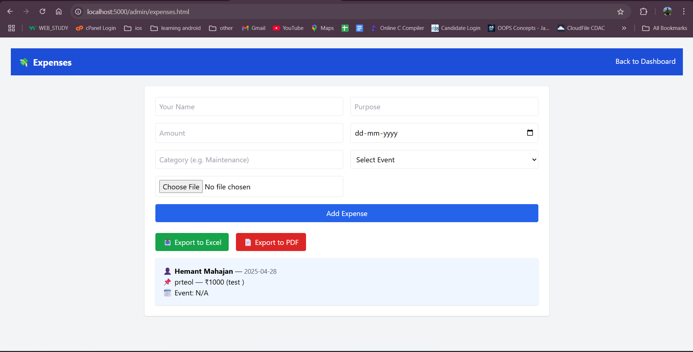
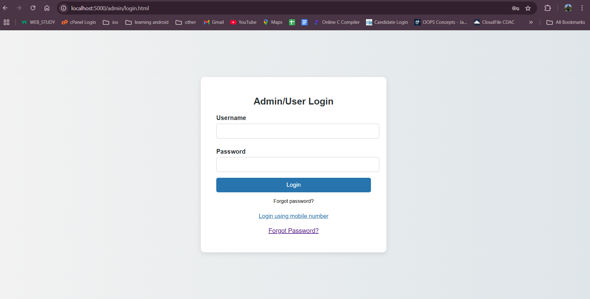

# 🛕 Temple Management Backend

A backend system built with **Node.js** and **Express** to power a temple website management platform. It offers RESTful APIs for managing **donations**, **donors**, **expenses**, **events**, **reports**, and **user authentication**, including a secure password reset mechanism.

---

## ✨ Features

### 🔐 User Authentication & Profile
- Login via **username + password** or **mobile number**.
- **Mobile login** supports password reset flow.
- Password reset requires users to set a new password before proceeding.
- **Profile page** to view and update password securely.

### 📁 CRUD Operations
Manage core temple data:
- **Donations**
- **Donors**
- **Expenses** (with image upload via Multer)
- **Events**
- **Reports**

Each supports **Create, Read, Update, Delete** operations.

### 📊 Derived Reports
- Aggregate donor reports with **event-based filtering**.

---

## 🧭 API Routes

| Endpoint                  | Method(s) | Description                                                  |
|---------------------------|-----------|--------------------------------------------------------------|
| `/api/login`              | POST      | Login with username/password or mobile number (reset flow)   |
| `/api/users`              | GET, POST | Get all users / Create a new user                            |
| `/api/users/:id`          | PUT       | Update user info (e.g., password)                            |
| `/api/donations`          | CRUD      | Manage donations                                              |
| `/api/donors`             | CRUD      | Manage donors                                                 |
| `/api/expenses`           | CRUD      | Manage expenses with image upload                             |
| `/api/events`             | CRUD      | Manage events                                                 |
| `/api/reports`            | CRUD      | Manage reports                                                |
| `/api/derived-donors`     | GET       | Aggregate donor report, filterable by event                  |

---

## 🔁 Password Reset Flow

1. User attempts login via **mobile number**.
2. Backend verifies the mobile number.
3. User is prompted to **reset the password**.
4. User updates password via `PUT /api/users/:id`.
5. User logs in again using the **new password**.

---

## ⚙️ Setup Instructions

1. Clone the repository:
   ```bash
   git clone https://github.com/your-username/temple-management-backend.git
   cd temple-management-backend
   ```

2. Install dependencies:
   ```bash
   npm install
   ```

3. Start the backend server:
   ```bash
   node backend/server.js
   ```

4. Visit: [http://localhost:5000](http://localhost:5000)

---

## 🔗 Frontend Integration Notes

- Set JSON headers in all API requests:
  ```javascript
  headers: {
    "Content-Type": "application/json"
  }
  ```

- Example password update request:
  ```json
  {
    "password": "newPassword123"
  }
  ```

- After reset, **clear saved session/localStorage** and redirect to login.

---

## ⚠️ Important Notes

- **Passwords are stored in plaintext** in `users.json` (for demo).  
  🔐 **Implement hashing** for production.
- Uses local storage with `data/*.json` files.
- Static files served from `/public` and `/admin`.
- Expense images are uploaded using **Multer**.

---

## 📧 Contact

**Hemant Pramod Mahajan**  
📧 Email: [hpmahajan2013@gmail.com](mailto:hpmahajan2013@gmail.com)

---

## 🖼️ Screenshots

### ✅ Admin Dashboard  


### 💰 Donation Entry  
**Page 1**  
  
**Page 2**  


### 👥 Donors Summary  


### 💸 Expenses Page  


### 🔐 Login Page  


### 🧑‍💼 Users Panel  


### 📅 Events Page  


### 📊 Reports Page  


### 🙋‍♂️ User Profile Page  


---

📅 **Last updated: May 2025**
